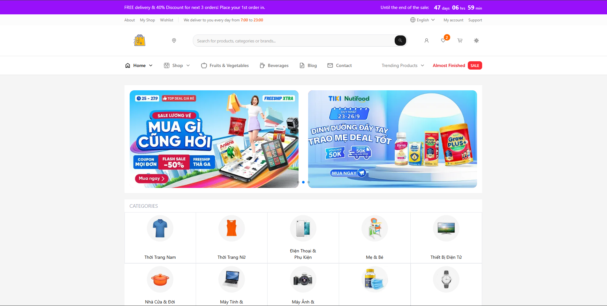

<div align="center">
  
  <h1>🚀 FastE - NEXT GENERATION E-COMMERCE PLATFORM</h1>

  [](https://nextjs.org/)
  [](https://www.typescriptlang.org/)
  [](https://tailwindcss.com/)
  [](LICENSE)

  <p><strong>FastE</strong> is a modern, high-performance e-commerce platform built with the latest web technologies. The project focuses on providing a seamless shopping experience with high speed, clean UI, and multi-language support.</p>
</div>

<br />



---

## ✨ Key Features

### 🛒 Shopping Experience (Client)
- **Marketplace**: Browse thousands of products with extreme performance powered by Next.js Turbopack.
- **Advanced Search**: Fast and intuitive product discovery.
- **Cart & Checkout**: Optimized checkout flow for a friction-less experience.
- **Internationalization (i18n)**: Full support for English, Vietnamese, Chinese, and Korean.
- **Modern UI/UX**: Smooth animations and transitions using GSAP and Framer Motion.

### 🏪 Seller Center
- **Store Management**: Manage products, orders, and inventory effortlessly.
- **Analytics**: Track sales performance and customer data with interactive charts.

### 🛡️ Admin Dashboard
- **System Control**: Manage users, products, and overall platform health.
- **Reporting**: Comprehensive reports on platform statistics.

---

## 🛠️ Tech Stack

### Core Stack
- **Framework**: [Next.js 15](https://nextjs.org/) (App Router & Turbopack)
- **UI & Styling**: [Tailwind CSS v4](https://tailwindcss.com/), [Radix UI](https://www.radix-ui.com/), [Lucide React](https://lucide.dev/)
- **State Management**: [Zustand](https://zustand-demo.pmnd.rs/) & [TanStack Query v5](https://tanstack.com/query)

### Libraries & Tools
- **Animations**: GSAP, Framer Motion
- **Form Handling**: React Hook Form, Zod, Yup
- **Charts**: Recharts
- **Internationalization**: i18next & next-i18n-router
- **Media & UI**: Swiper, Quill Editor, Sonner (Toasts), Vaul (Drawers)

### Development Workflow
- **Testing**: Vitest, Playwright, Storybook 9
- **Linter & Formatter**: ESLint, Prettier, Husky, Commitlint
- **Deployment**: Ready for Vercel & Docker environments

---

## 🚀 Getting Started

### Prerequisites
- Node.js >= 18.x
- npm / yarn / pnpm

### Installation
1. Clone the repository:
   ```bash
   git clone https://github.com/ahkiet22/faste-client.git
   cd faste-client
   ```
2. Install dependencies:
   ```bash
   npm install
   ```
3. Set up environment variables: create a `.env` file based on `.env.example`.

### Running the App
- **Development Mode:**
  ```bash
  npm run dev
  ```
- **Build for Production:**
  ```bash
  npm run build
  ```
- **Storybook (UI Docs):**
  ```bash
  npm run storybook
  ```

---

## 📂 Project Structure
```text
src/
├── app/            # Next.js App Router (Layouts, Pages, APIs)
├── components/     # Reusable UI components
├── hooks/          # Custom react hooks & mutations/queries
├── services/       # API services & data fetching logic
├── stores/         # Zustand state management
├── types/          # TypeScript interfaces & types
├── views/          # Page-specific views & logic
└── ...
```

---

## 🤝 Contributing
Contributions, issues, and feature requests are welcome! Feel free to check the issues page and submit pull requests.

---

## 📄 License
This project is licensed under the **MIT License**.

© 2025 **ahkiet lekiett2201@gmail.com**
